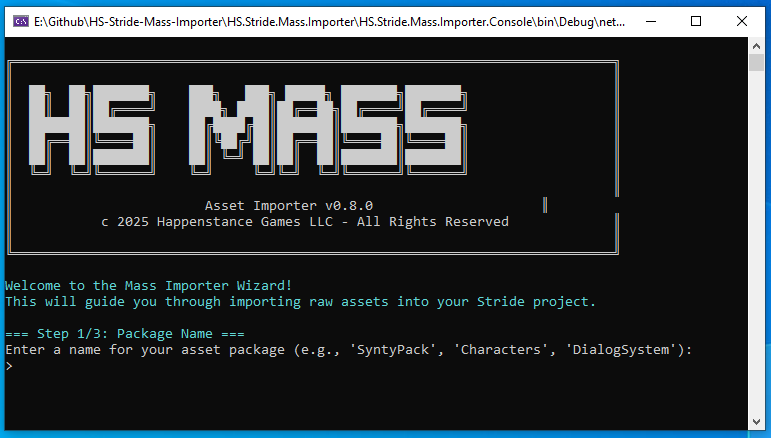

# HS Stride Mass Importer
A bulk asset importer for the Stride game engine that converts raw asset files (.fbx, .png, .jpg, etc.) into proper Stride assets (.sdtex, .sdmat, .sdm3d, etc.) with correct folder structure and cross-references.



## 🎯 Why This Tool Exists
Importing hundreds of game assets one-by-one in Stride GameStudio is tedious and time-consuming. This tool automates the bulk import process while maintaining proper folder organization and asset relationships.

**The Problem:** Manual asset import in Stride requires:
- Importing each texture, model, and audio file individually by dragging into GameStudio or into the resource folder, then creating each asset by hand
- Creating materials and linking them to textures manually
- Importing raw files like .json one at a time (useful for dialog systems when you need to import hundreds of JSON files or CSVs)

**The Solution:** HS Stride Mass Importer handles all of this automatically in a simple 3-step process.

## ✨ What This Tool Handles

### ✅ Fully Supported Assets
- **Textures** (.png, .jpg, .jpeg, .bmp, .tga, .dds) → `.sdtex` assets
- **3D Models** (.fbx, .obj, .dae, .gltf, .glb) → `.sdm3d` assets  
- **Materials** (auto-generated from textures) → `.sdmat` assets
- **Raw Assets** (.json, .xml, .txt, .csv) → `.sdraw` assets
- **Audio Files** (.wav, .mp3, .ogg, .flac) → `.sdsnd` assets
- **C# Code** (.cs) → Imported directly into your project's code folder

⚠️ **Note on .cs files:** C# scripts are imported directly as source code into your project, but most asset packs include Unity-specific code that won't compile in Stride. These scripts typically need significant modification to work with Stride's API.

### ⚠️ What You Should Import Manually
- **Animations** - Complex import requiring precise control
- **Skeletons** - Requires manual setup and configuration
- **Complex Materials** - Auto-generated materials are basic; create custom materials in GameStudio
- **Specialized Assets** - Fonts, videos, shaders, etc.

### 🔄 Automatic Features
- **Folder Structure Preservation** - Maintains your source organization
- **Path Fixing** - Updates all asset references to work correctly
- **Material Generation** - Creates basic materials for each texture
- **Resource Organization** - Places files in proper Resources/ and Assets/ locations

**How I'm using this tool:** I create a new Stride project to import all the assets I need, then use [HS Stride Packer](https://github.com/Keepsie/HS-Stride-Packer) to export a .stridepackage and import it into my real Stride projects later. I plan on using the Synty Prototype kit frequently, so it made sense to create a reusable .stridepackage.

Mass importing .json data and CSV files for dialog systems created in external tools for NPCs, being able to mass import raw assets was essential.

## 🚀 Installation & Usage

### Prerequisites
- .NET 8.0 Runtime
- Stride Game Project (4.2 or newer recommended)

### Getting Started
1. Build and run `HS.Stride.Mass.Importer.Console`
2. Follow the 3-step wizard:
   - **Step 1:** Enter package name (e.g., "SyntyPack", "Characters")
   - **Step 2:** Select source folder containing your raw assets
   - **Step 3:** Select target Stride project directory

The importer will automatically:
- Scan and categorize your assets
- Copy resources with proper folder structure
- Generate Stride assets with correct references
- Create basic materials for textures

## 📁 How It Organizes Your Assets

### Input Structure (Ideally your pack is already organized like this)
```
SourceFolder/
├── Characters/
│   ├── hero.fbx
│   └── hero_texture.png
├── Weapons/
│   ├── sword.fbx
│   └── sword_diffuse.png
└── Audio/
    └── sword_clash.wav
```

### Output Structure
```
StrideProject/
├── Resources/PackageName/
│   ├── Characters/
│   │   ├── hero.fbx
│   │   └── hero_texture.png
│   ├── Weapons/
│   │   ├── sword.fbx
│   │   └── sword_diffuse.png
│   └── Audio/
│       └── sword_clash.wav
└── Assets/PackageName/
    ├── Characters/
    │   ├── hero.sdm3d
    │   ├── hero_texture.sdtex
    │   └── Materials/
    │       └── hero_texture_Mat.sdmat
    ├── Weapons/
    │   ├── sword.sdm3d
    │   ├── sword_diffuse.sdtex
    │   └── Materials/
    │       └── sword_diffuse_Mat.sdmat
    └── Audio/
        └── sword_clash.sdsnd
```

## ⚙️ Best Practices

### ✅ Recommended Source Organization
```
AssetPack/
├── Models/           # Clear folder names
├── Textures/        
├── Audio/           
└── Data/            # JSON, XML, config files
```

### ✅ Good Package Names
- `SyntyFantasy` - Asset pack identification
- `PlayerCharacters` - Asset type description
- `UIElements` - Functional grouping

### ❌ Avoid These Patterns
```
AssetPack/
├── random_stuff/    # Unclear organization  
├── test_files/      # Temporary content
├── backup/          # Non-game assets
└── untitled_folder/ # Generic names
```

## 🔧 Technical Details

### Supported File Types
| Type | Extensions | Output |
|------|------------|--------|
| Textures | .png, .jpg, .jpeg, .bmp, .tga, .dds | .sdtex assets |
| Models | .fbx, .obj, .dae, .gltf, .glb | .sdm3d assets |
| Audio | .wav, .mp3, .ogg, .flac | .sdsnd assets |
| Raw Assets | .json, .xml, .txt, .csv | .sdraw assets |
| C# Code | .cs | Source code files |

**Note:** .cs files from asset packs are usually Unity-specific and require modification for Stride.

## ⚠️ Important Limitations

### What This Tool Is NOT
- ❌ **Not a full pipeline replacement** - Advanced materials need manual creation
- ❌ **Not an animation importer** - Animations require careful setup in GameStudio  
- ❌ **Not reversible** - No "uninstall" feature (manual cleanup required)

### Before Importing
- ⚠️ **Close Stride GameStudio** for best results
- 🔄 **Backup your project** before large imports
- 📁 **Organize source assets** in logical folders first

## 🤝 Contributing

This tool is designed to handle the most common bulk import scenarios. If you encounter file types or workflows that aren't supported, contributions are welcome.

## 📄 License

Apache License 2.0 - see LICENSE.txt for full text.

**HS Stride Mass Importer**  
Copyright © 2025 Happenstance Games LLC